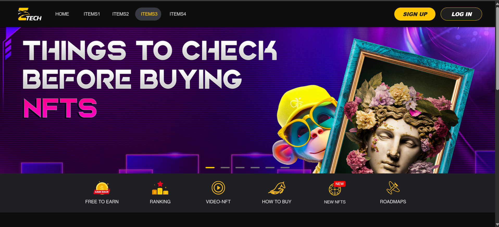
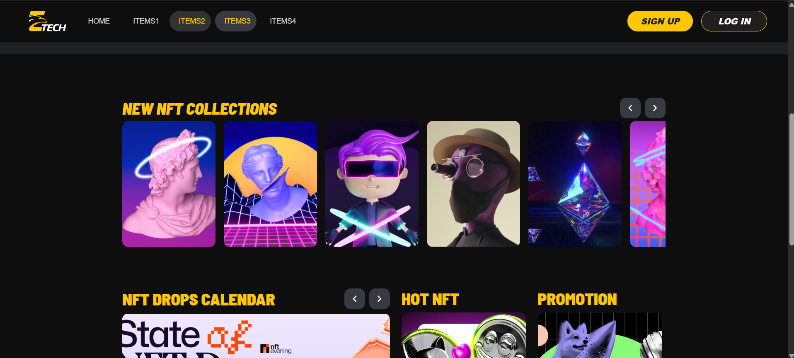
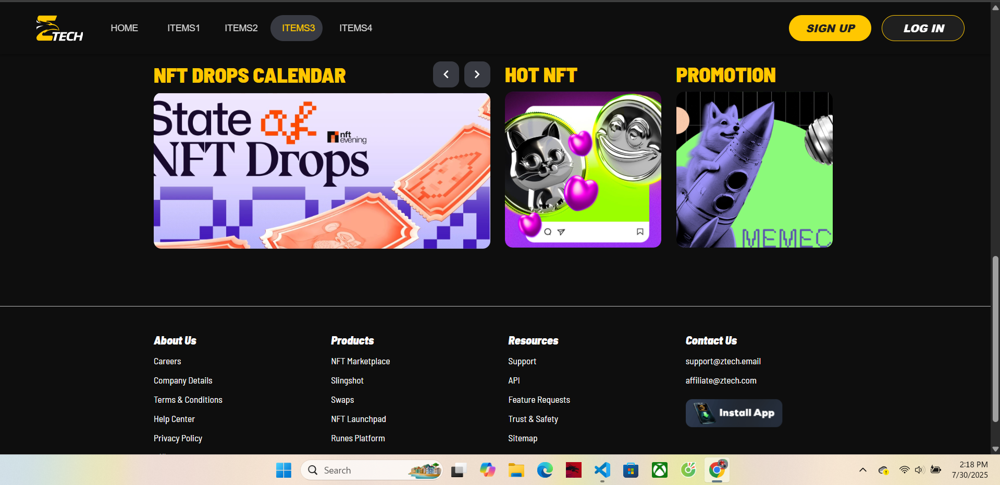
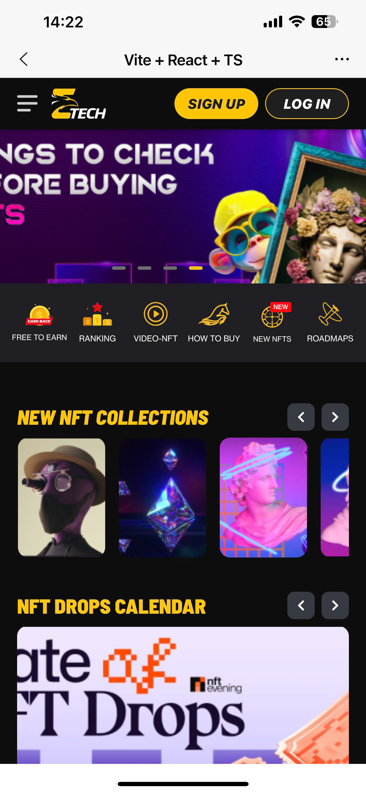
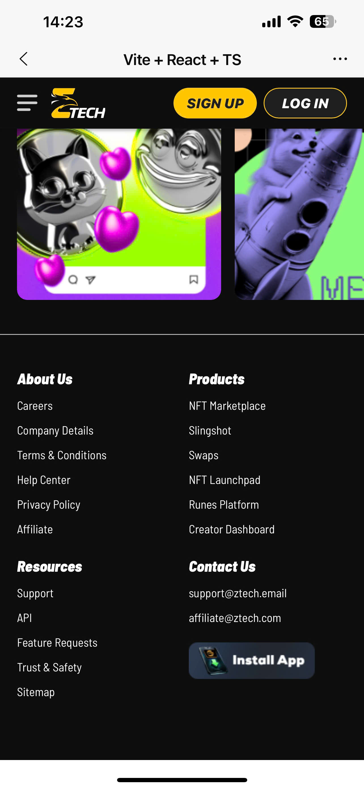
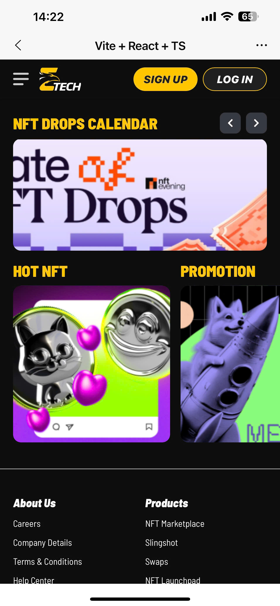

# Nevel Tech – Frontend Developer Test

Bài test cho vị trí **Frontend Developer** tại Nevel Tech.  
Trang web cần bao gồm các yếu tố sau:

- Code ra đúng giao diện thiết kế.
- Đảm bảo tính năng đáp ứng (responsive).

---

## Link Deploy (Demo Online)

👉 [https://test-frontend-sable.vercel.app/]

## Link github

👉 [https://github.com/PhanVanBach/test-frontend]

---

## Demo Screenshot








---

## Mô tả dự án

Dự án này là bài test Front-end Developer cho công ty Nevel Tech.

Trang web được xây dựng bằng React.js, TypeScript, và styled-components, nhằm clone lại thiết kế từ Figma và đảm bảo tính responsive.

## Các tính năng đã hoàn thành:

- Giao diện giống thiết kế Figma (desktop, mobile)

- Responsive đầy đủ (sử dụng media query)

- Hover/click hiệu ứng rõ ràng trên desktop

- Tối ưu code theo từng component riêng biệt

- Cấu trúc folder rõ ràng, dễ maintain

- Dùng styled-components để xử lý style linh hoạt

- Tối ưu cho mobile: bỏ hover, thay đổi layout

- Viết bằng TypeScript toàn bộ dự án

## Tech Stack

- React.js
- Styled-components
- React Router DOM
- Responsive Web Design
- Git + GitHub
- Vercel (Deploy)

---

## Cách chạy project local

```bash
# Clone về máy
git clone https://github.com/PhanVanBach/test-frontend.git

# Cài đặt package
npm install

# Chạy dev server
npm run dev
```
